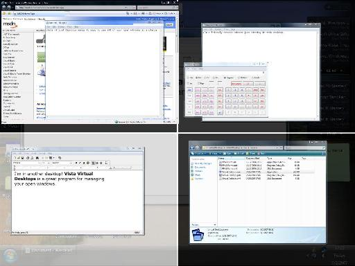

# Finestra Virtual Desktops

> NOTE: This project is archived from 2012. It is not being actively developed.

[More Screenshots](wiki/Screenshots.md)

Finestra Virtual Desktops is an elegant solution to managing many windows or tasks on Windows. It allows you to divide your workspace up into multiple "virtual" desktops, each of which is easily accessible on the fly. For example, you can keep all of your internet applications open on one desktop, work on another desktop, and games on a third.

Finestra virtual desktops is also well known for taking advantage of Windows' live window thumbnails to show you live previews of your windows when viewed from the fullscreen "switcher" view. If you have Windows 7, Finestra also utilizes the new taskbar features to make the experience even more natural and enjoyable.

But wait! What if you still are using XP? Don't worry, Finestra Virtual Desktops provides support for XP as well, although window previews are not "live" since XP doesn't have DWM.

Finestra Virtual Desktops is developed and managed by [Z-Systems](http://www.z-sys.org/), which also produces a few other fine commercial and open-source projects.

### Features
* Full screen switcher view with full drag and drop managing
* Desktop switch indicator
* As many virtual desktops as desired
* Per-desktop backgrounds
* Windows 7 taskbar switcher
* Z-order preservation
* Watch the windows move in real time as you drag them around in the switcher
* Multiple monitor support
* Window menus
* Configurable tray icons for each desktop
* Configurable colors, fade speeds, hotkeys, etc.
* Uses Vista/7's live thumbnails
* XP support
* And much more!

### Default Shortcut Reference
* *Windows Key + Z* - Show the fullscreen "switcher"
* *Windows Key + W* - Pop up the window menu for the active window
* *Windows Key + Numpad 1...9* - Switch to the corresponding desktop, if it exists
* *Windows Key + Arrow Keys* - Move to the corresponding desktop
* *Windows Key {"+ Control +"} Numpad 1...9* - Send the foreground window to the corresponding desktop
* *Windows Key {"+ Control +"} Arrow Keys* - Send the foreground window to the corresponding desktop

### Awards

[Up to Down Software (Spanish)](http://virtual-desktop-manager.uptodown.com/)

[Download.hr - Clean Software](wiki/downloadhr_safe_award_eng.gif)
[Download.hr](http://www.download.hr/windows/file/5552/Vista/XP-Virtual-Desktops)
